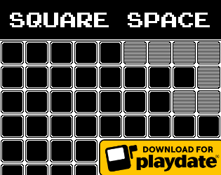
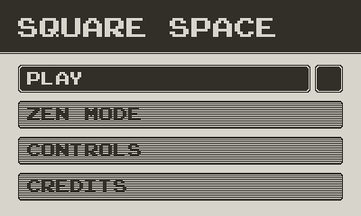
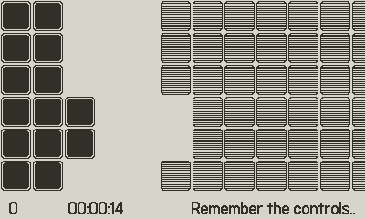
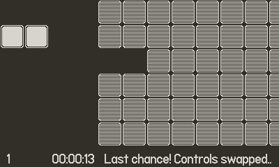
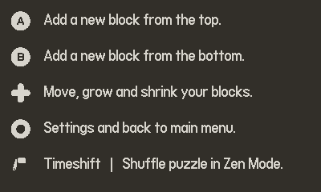

# Square Space

Square Space is a real time puzzle game for <a href="https://play.date" target="_blank">Playdate</a>, where you need to build the shape to finish the puzzle and pass to the next level. Each time it will be more complicated, so try to beat your high score! If you fail there is a second chance.. with a twist. There is also a zen mode for a stress free experience.

This is my first game ever!
Made for the <a href="https://itch.io/jam/playjam-10">PlayJam 10</a> Game Jam.

## How to Install

Download the pdx file and <a href="https://help.play.date/games/sideloading/" target="_blank">sideload</a> in your playdate!
If you don't have a Playdate you can get one, it's quite fun! If you just want to try the game you can <a href="https://play.date/dev/" target="_blank">install the simulator</a> in pc and load the game. It should work with a controller as well, but using the crank might not be the best.

### To-Do's

- [ ] Music with the PO-33 K.O.
- [ ] Improve sound fx for key presses.
- [ ] Add animations for squares being added / removed.
- [ ] Onboarding to teach the player how to construct some shape arrangements (before main menu on first launch with the option to launch again from the main menu) that way we could start the game maybe at level 3 already.
- [ ] Adjust friction and other difficulty tweaks for a more challenging experience.
- [ ] Fix FPS at higher levels, with more squares to render.
- [ ] Check for impossible puzzles (for example some E shapes might be impossible to build).
